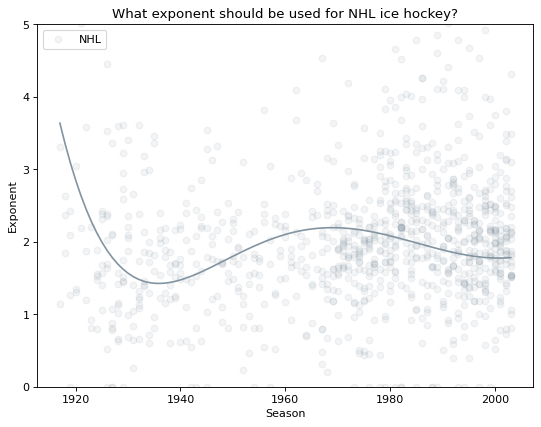

# Estimating Exponent for Pythagorean Method of Expected Win Percentage in Various Leagues

## Background
Bill James defined the ["Pythagorean Theorem of Baseball,"](https://www.baseball-reference.com/bullpen/Pythagorean_Theorem_of_Baseball) as a tool to predict a team's final win record based on their performance in the season to this point, which is useful for coaches and commentators for a variety of reasons, and is so named because of superficial similarity to the Pythagorean Theorum for finding the length of the hypatenuse c of a right triangle abc: ````a^2 + b^2 = c^2````. [Other sports statisticians](http://www.rawbw.com/~deano/helpscrn/pyth.html) have since adapted the method for other sports, with different exponents to account for differing scoring systems. For example, in basketball, [ESPN uses ^16.5](http://www.espn.com/nba/stats/rpi). 

How closely do these numbers work for recent seasons? How has the exponent changed over time, and is this method actually any good for other sports?

I start here with the NHL.

## Collection
Using the official NHL API, I requested points scored for and against each franchise and comparing that to win% for the franchise in each season of the NHL, shown in [this script](https://github.com/jgengelhardt/sports-pythagorean-exponent/blob/main/estimate_NHL_exponent.py). The results of this collection, organization, and analysis were saved into a .csv spreadsheet file.

## Visualization

Plotted from the data mentioned previously, using matplotlib, numpy, and pandas, in the script shown [here](https://github.com/jgengelhardt/sports-pythagorean-exponent/blob/main/plot_NHL_exponents.py).

## Interpretation
[Kevin Dayaratna and Steven J. Miller](https://web.williams.edu/Mathematics/sjmiller/public_html/math/papers/DayaratnaMiller_HockeyFinal.pdf) estimated an exponent slightly greater than 2 for hockey, though the above chart suggests an exponent slightly lower than 2 would produce more reliable predictions for the most recent seasons.
